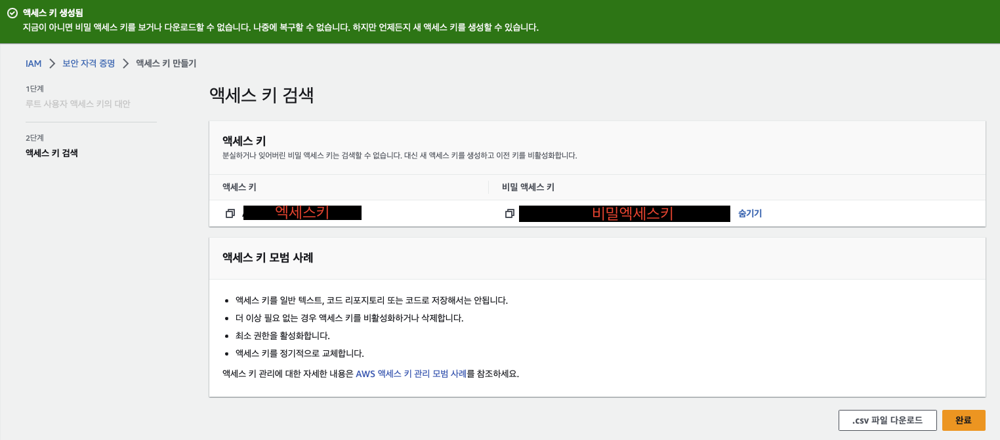

# Setting up a local environment for training AWS DeepRacer on Ubuntu 20.04 LTS

Ubuntu 20.04 LTS에서 GPU를 이용하여 AWS deepracer를 훈련시키고,
AWS s3를 이용하여 deepracer 모델을 import하는 방법.

## 1. Nvidia GPU Driver 설치
1. 그래픽 확인 (현재 GTX 1660 ti 사용 중)

2. 엔비디아 홈페이지에서 그래픽 카드의 이름과 동일한 드라이버 검색
 * https://www.nvidia.co.kr/Download/index.aspx?lang=kr

3. 그래픽 드라이버를 검색하면 버전이라는 항목이 존재
```bash
sudo apt install nvidia-driver-<버전의 앞 3자리>

sudo reboot

nvidia-smi
```

## 2. install docker (도커 설치)
```bash
sudo apt update

sudo apt install apt-transport-https ca-certificates curl software-properties-common

curl -fsSL https://download.docker.com/linux/ubuntu/gpg | sudo apt-key add -

sudo add-apt-repository "deb [arch=amd64] https://download.docker.com/linux/ubuntu $(lsb_release -cs) stable"

sudo apt update

sudo apt install docker-ce

sudo systemctl start docker

sudo usermod -aG docker $USER
```

## 3. install NVIDIA-docker image (NVIDIA-docker 설치)
```bash
sudo apt-get update
sudo apt-get install apt-transport-https ca-certificates curl gnupg-agent software-properties-common
curl -fsSL https://download.docker.com/linux/ubuntu/gpg | sudo apt-key add -
sudo add-apt-repository "deb [arch=amd64] https://download.docker.com/linux/ubuntu $(lsb_release -cs) stable"
sudo apt-get update
sudo apt-get install docker-ce docker-ce-cli containerd.io

curl -s -L https://nvidia.github.io/nvidia-docker/gpgkey | sudo apt-key add -
distribution=$(. /etc/os-release;echo $ID$VERSION_ID)
curl -s -L https://nvidia.github.io/nvidia-docker/$distribution/nvidia-docker.list | sudo tee /etc/apt/sources.list.d/nvidia-docker.list
sudo apt-get update

sudo apt-get install -y nvidia-docker2
sudo systemctl restart docker

sudo usermod -aG docker $USER
```

## 4. install deepracer pakage (deepracer pakage 설치)
```bash
sudo apt-get install jq awscli python3-boto3 docker-compose

curl -fsSL https://download.docker.com/linux/ubuntu/gpg | sudo apt-key add -
sudo add-apt-repository    "deb [arch=amd64] https://download.docker.com/linux/ubuntu $(lsb_release -cs) stable"
sudo apt-get update && sudo apt-get install -y --no-install-recommends docker-ce docker-ce-cli containerd.io

distribution=$(. /etc/os-release;echo $ID$VERSION_ID)
curl -s -L https://nvidia.github.io/nvidia-docker/gpgkey | sudo apt-key add - 
curl -s -L https://nvidia.github.io/nvidia-docker/$distribution/nvidia-docker.list | sudo tee /etc/apt/sources.list.d/nvidia-docker.list

cat /etc/docker/daemon.json | jq 'del(."default-runtime") + {"default-runtime": "nvidia"}' | sudo tee /etc/docker/daemon.json
sudo usermod -a -G docker $(id -un)
```

## 5. AWS CLI 설정
AWS CLI는 python 기반으로 작성되어 Boto 패키지 설치필요.
```bash
pip install boto
```

access key 생성 방법
1. 아마존 사이트 이동 : https://aws.amazon.com/ko/
2. 우측 상단의 `내 계정` - `보안 자격증명` - `액세스 키` - `액세스 키 만들기`에서 엑세스 키 생성
    
    **중요!! 나중에 ubuntu에 AWS CLI설치후, 액세스 키, 비밀 액세스 키가 필요하니 잘적어둔다.**
3. ubuntu 명령창에서 AWS CLI 설치

```bash
curl "https://awscli.amazonaws.com/awscli-exe-linux-x86_64.zip" -o "awscliv2.zip"
unzip awscliv2.zip
sudo ./aws/install

aws --version
rm -f awscliv2.zip
```

## 6. 훈련을 위한 초기설정
1. 환경 초기설정
```bash
git clone https://github.com/aws-deepracer-community/deepracer-for-cloud.git

sudo reboot

cd deepracer-for-cloud && bin/init.sh -a gpu -c local
```

2. 모델 업로드를 위한 AWS configure 설정
```bash
aws configure
AWS Access Key ID [None]: <4.에서 만든 엑세스키 입력>
AWS Secret Access Key [None]: <4.에서 만든 비밀 엑세스키 입력>
Default region name [None]: us-east-1
Default output format [None]: <그냥 엔터>
```

1 ~ 4 까지의 과정을 거치면 ubuntu에서 Deep racer를 학습시킬 환경구축 및 패키지 설치,
AWS s3를 이용하여 로컬환경에서 훈련시킨 모델을 aws 클라우드에 import할 수 있다.

## 7. 훈련시작 방법

1. activate.sh 실행 (dr-명령어를 사용하게 만드는 실행 파일)
```bash
source bin/activate.sh
```

2. system.env, run.env 설정

Configure `system.env` as follows:
* DR_LOCAL_S3_PROFILE=default
* DR_LOCAL_S3_BUCKET=<bucketname> : ubuntu 에서 사용할 이름 (아무거나 정해되 됨)
* DR_UPLOAD_S3_PROFILE=default
* DR_UPLOAD_S3_BUCKET=<your-aws-deepracer-bucket> : AWS s3에 존재하는 버킷

Configure `run.env` as follows:
* 개인의 목적에 맞춰서 시뮬레이션 환경설정
* track결정할때, track.npy의 파일이름을 알아야 한다. 아래 사이트는 track.npy의 이름들이 나와있는 사이트다.
 * https://github.com/aws-deepracer-community/deepracer-race-data/tree/main/raw_data/tracks

3. 환경 및 동작 업데이트
```bash
dr-update
```

4. 차량의 액션, RL알고리즘, 보상함수 설정
Define your custom files in `custom_files/` - samples can be found in `defaults` which you must copy over:
* hyperparameters.json - definining the training hyperparameters
* model_metadata.json - defining the action space and sensors
* reward_function.py - defining the reward function
```bash
dr-upload-custom-files
```

## 8. 훈련 시작
```bash
dr-start-training
```

## 9. 훈련을 중지할때,
**반드시 dr-stop-training 명령어를 입력해야 다음에 계속해서 훈련이 가능하다.**
```bash
dr-stop-training
```

## 10. 다시훈련을 시작할 때,
```bash
dr-upload-custom-files

dr-increment-training

dr-start-training
```

## 11. 모델을 s3에 업로드
**Sagemaker must be running for this to work**
**따라서, 훈령중 ctrl + z를 눌러서 멈춘뒤, 아래 명령어를 입력해야 모델이 제대로 올라가서 AWS Deepracer 콘솔에서 import 할수있고 실제 차량에도 탑재가 가능해진다.**

1. Virtual DRFC Upload

Uploads best checkpoint to s3
```bash
dr-set-upload-model
```

2. Physical DRFC Upload
Sagemaker must be running for this to work
Only uses last checkpoint, not best
```bash
dr-upload-car-zip
```


## 12. EORROR발생시 재설치 하지말고 아래 명령어를 순차적으로 입력
```bash
docker swarm leave --force

cd deepracer-for-cloud && bin/init.sh -a gpu -c local

source bin/activate.sh

dr-update

dr-upload-custom-files

dr-start-training
```

**reference**

https://github.com/phsria0825/deepracer-for-cloud/tree/6ac72fd577be06a2203ba121711de84d4c9dedda/docs

https://wiki.deepracing.io/Customise_Local_Training

https://aws-deepracer-community.github.io/deepracer-for-cloud/

https://github.com/aws-deepracer-community/deepracer-log-guru (로그분석 도구)